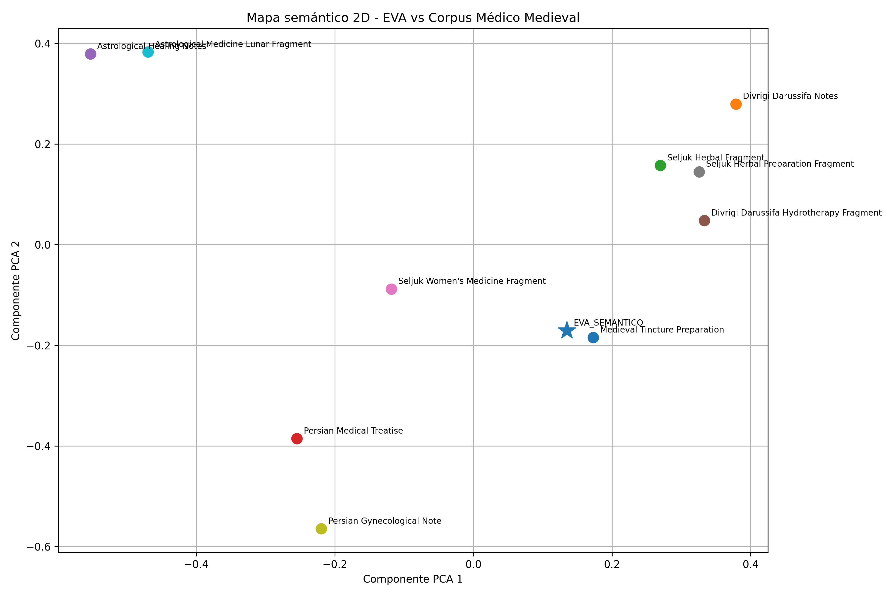

Sí. En PowerShell, dentro de:

`powershell
C:\Users\wcalm\voynich_project
`

ejecuta este bloque completo:

``powershell
@"
# 🔓 Voynich Semantic Analyzer

## A Semantic, Astronomical and Botanical Analysis Framework for the Voynich Manuscript

DOI: https://doi.org/10.5281/zenodo.20413096

### Walter Calmels Von dem Knesebeck
Independent Researcher  
Santiago, Chile  
wcalmels@phi47.cl

---

# Overview

Voynich Semantic Analyzer is an experimental computational framework for contextual semantic exploration of the Voynich Manuscript using:

- EVA processing
- semantic embeddings
- transformer models
- semantic clustering
- medieval corpus comparison
- NLP pipelines
- contextual visualization

## Abstract

This project presents an experimental computational framework for contextual semantic analysis of the Voynich Manuscript using transformer embeddings, semantic clustering, medieval corpora comparison and interdisciplinary digital humanities methodologies.

The framework explores relationships between EVA-derived symbolic structures and medieval medical, botanical and astronomical corpora through reproducible NLP pipelines and visualization techniques.

---

# Scientific Disclaimer

This project does NOT claim definitive decipherment of the Voynich Manuscript.

The framework is intended as exploratory computational research, semantic-contextual analysis, experimental NLP methodology and digital humanities infrastructure.

All semantic interpretations remain hypothetical and computationally inferred.

---

# Core Pipeline

`	ext
Voynich Folios
        ↓
Glyph Extraction
        ↓
OCR / Segmentation
        ↓
EVA Processing
        ↓
Semantic Families
        ↓
Transformer Embeddings
        ↓
Semantic Clustering
        ↓
Medieval Corpus Comparison
        ↓
Contextual Similarity Analysis
``

---

# Features

## EVA Processing

* tokenization
* bigram analysis
* semantic families
* lexical analysis

## NLP & Embeddings

* TF-IDF embeddings
* sentence-transformers embeddings
* cosine similarity
* semantic comparison

## Semantic Clustering

* automatic clustering
* unsupervised grouping
* semantic vector analysis

## Visualization

* PCA semantic maps
* 2D embeddings visualization
* semantic cluster display

## Semantic Embedding Visualization

## Medieval Corpus

* Anatolian-Seljuk corpus
* Persian medical fragments
* hydrotherapy
* herbal preparation
* astrological medicine

## Interactive Platform

Built using:

* Python
* Streamlit
* OpenCV
* Pandas
* Scikit-learn
* Sentence Transformers

---

# Installation

## Clone Repository

`ash
git clone https://github.com/wcalmels/voynich-semantic-analyzer.git
cd voynich-semantic-analyzer
`

## Create Virtual Environment

`ash
python -m venv venv
`

## Activate Environment

### Windows

`ash
.\venv\Scripts\Activate.ps1
`

## Install Dependencies

`ash
pip install -r requirements.txt
`

---

# Run Platform

`ash
streamlit run src/app_voynich.py
`

Open:

`	ext
http://localhost:8501
`

---

# Experimental Results

Current transformer embedding analysis suggests contextual convergence between EVA-derived semantic structures and:

* herbal medicine
* hydrotherapy
* medicinal preparation
* bodily processes
* medieval gynecology
* astrological medicine

---

# Scientific Position

The framework should be interpreted as:

* computational semantic exploration
* contextual clustering methodology
* medieval semantic infrastructure prototype
* experimental NLP system

and NOT as:

* definitive translation
* proven decipherment
* historically verified linguistic decoding

---

# Research Domains

* Computational Philology
* Historical NLP
* Medieval Linguistics
* Digital Humanities
* Semantic Embeddings
* Botanical Analysis
* Astronomical Symbolism

---

# Reproducibility

All experiments included in this repository are designed to be reproducible using the provided datasets and scripts.

---

# Roadmap

* [x] Initial semantic framework
* [x] Medieval corpus integration
* [x] Embedding analysis
* [x] Zenodo DOI publication
* [ ] Transformer benchmarking
* [ ] Astronomical symbol mapping
* [ ] Botanical correlation engine
* [ ] Multimodal manuscript analysis
* [ ] Interactive web visualization

---

# License

## Code

MIT License

## Paper & Research

CC-BY 4.0

---

# Citation

If you use this repository in academic work, please cite:

Walter Calmels Von dem Knesebeck.
Voynich Semantic Analyzer v1.0.1.
Zenodo (2026).

DOI: [https://doi.org/10.5281/zenodo.20413096](https://doi.org/10.5281/zenodo.20413096)

---

# Contact

Walter Calmels Von dem Knesebeck
[wcalmels@phi47.cl](mailto:wcalmels@phi47.cl)
