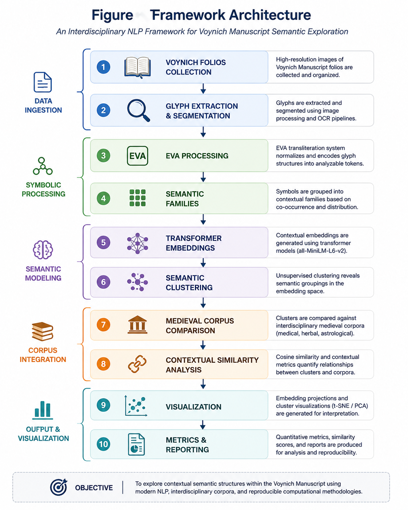

# Voynich Semantic Analyzer

## A Computational Semantic Framework for Contextual Exploration of the Voynich Manuscript

**Author:** Walter Calmels Von dem Knesebeck
**Affiliation:** Independent Researcher, Chile 
**wcalmels@phi47.cl
**Repository:** https://github.com/wcalmels/voynich-semantic-analyzer
**DOI:** https://doi.org/10.5281/zenodo.20413096
**Version:** v1.2.0
**Date:** May 2026

---

# Abstract

The Voynich Manuscript (Beinecke MS 408) remains one of the most extensively studied undeciphered manuscripts in the history of cryptography, linguistics, codicology and manuscript studies.

This paper presents an experimental computational framework for contextual semantic exploration of the Voynich Manuscript using transformer embeddings, semantic clustering, medieval corpus comparison and interdisciplinary digital humanities methodologies.

The framework integrates EVA token processing, medieval medical corpora, semantic embeddings, contextual similarity analysis and visualization pipelines to investigate whether measurable semantic structures may emerge within historically plausible contextual domains.

The project does not claim definitive decipherment of the Voynich Manuscript. Instead, it proposes a reproducible computational infrastructure for exploratory semantic analysis and contextual reconstruction.

Preliminary results suggest contextual convergence between EVA-derived symbolic structures and medieval thematic domains associated with herbal medicine, hydrotherapy, gynecology, medicinal preparation and astrological medicine.

---

# Keywords

Voynich Manuscript, Digital Humanities, Historical NLP, Semantic Embeddings, Computational Philology, Medieval Medicine, Transformer Models, Semantic Clustering

---

# 1. Introduction

The Voynich Manuscript has resisted definitive decipherment for more than a century. Its unknown script, botanical imagery, astronomical diagrams and pharmaceutical sections have generated numerous linguistic, cryptographic and historical hypotheses.

Previous approaches frequently focused on direct decipherment, substitution systems or isolated statistical analysis. The present framework instead emphasizes semantic-contextual modeling through modern Natural Language Processing methodologies.

The central hypothesis explored in this work is that contextual semantic relationships may be computationally detectable even in partially unknown symbolic systems when analyzed through interdisciplinary corpora and transformer-based embedding methods.

This framework combines:

* EVA symbolic processing
* semantic embeddings
* contextual clustering
* medieval medical corpora
* visualization pipelines
* reproducible computational workflows

The manuscript is therefore treated not as an isolated cryptogram, but as a potentially structured historical artifact whose contextual semantic organization may be partially measurable.

---

# 2. Related Work

Previous computational studies of the Voynich Manuscript explored:

* statistical linguistic structure
* entropy analysis
* symbolic recurrence
* lexical distribution
* cryptographic hypothesis testing
* contextual co-occurrence patterns

Important prior contributions include the statistical analyses of Landini (2001), contextual studies by Montemurro & Zanette (2013), and the EVA transliteration framework developed by Takahashi.

Unlike traditional decipherment-oriented approaches, the present work emphasizes contextual semantic infrastructure and transformer-based NLP methodologies.

---

# 3. Research Position and Scope

This project should be interpreted as:

* exploratory computational humanities research
* semantic-contextual NLP experimentation
* historical hypothesis modeling
* medieval corpus comparison
* reproducible framework development

This project does not claim:

* definitive translation of Voynichese
* proof of authorship
* proof of geographic origin
* direct symbol-to-letter equivalence
* complete linguistic decoding

The objective is instead to evaluate whether EVA-derived symbolic structures exhibit measurable contextual convergence with historically plausible medieval semantic domains.

---

# 4. Integrated Historical Hypothesis

The working hypothesis explored in this framework is that the Voynich Manuscript may preserve semantic structures associated with medieval Anatolian-Islamic medical traditions.

Potential contextual domains include:

* herbal medicine
* hydrotherapy
* pharmacological preparation
* gynecological medicine
* astrological medicine
* bodily regulation

Institutions such as the Divriği Darüşşifa and broader Anatolian medical traditions provide contextual reference models, although no direct documentary attribution is claimed.

---

# 5. Botanical and Historical Layer

The botanical layer investigates whether selected plant illustrations exhibit contextual similarity with medicinal flora associated with medieval Anatolian and Islamic pharmacological traditions.

Preliminary analyses examined potential correspondences involving:

* Papaver somniferum
* Mandragora officinarum
* Hypericum perforatum
* Juniperus species
* Colchicum autumnale

These identifications remain probabilistic and require specialist botanical validation.

The purpose of this layer is not definitive identification, but contextual hypothesis generation.

---

# 6. EVA Statistical Analysis

Statistical analysis of the EVA corpus revealed:

* Zipf-like token distributions
* repetitive suffix structures
* frequency regularities
* lexical-family recurrence
* entropy levels compatible with structured symbolic systems

These observations do not establish linguistic identity, but support the hypothesis that Voynichese exhibits non-random structural organization.

---

# 7. Computational Framework Architecture

The framework integrates symbolic preprocessing, semantic embeddings, contextual clustering and medieval corpus comparison into a reproducible computational pipeline.

### Figure 1. Framework Architecture

The architecture combines image processing, EVA token analysis, semantic embeddings and contextual similarity analysis.

---

# 8. Medieval Corpus Infrastructure

An experimental medieval semantic corpus was constructed using fragments associated with:

* Anatolian-Seljuk medicine
* Persian medical terminology
* hydrotherapy
* herbal preparation
* astrological medicine
* gynecology

The corpus is partially curated and intended primarily for methodological experimentation.

Future work requires larger multilingual historical corpora.

---

# 9. Transformer Embeddings and Semantic Metrics

The framework generated multidimensional semantic embeddings using:

sentence-transformers/all-MiniLM-L6-v2

Embedding dimensionality:

* 384 dimensions

Cosine similarity analysis revealed contextual convergence between EVA-derived semantic structures and medieval medical-thematic domains.

### Table 1. Top Semantic Similarity Relationships

| Fragment A                              | Fragment B                           | Cosine Similarity |
| --------------------------------------- | ------------------------------------ | ----------------- |
| Seljuk Herbal Preparation Fragment      | Seljuk Herbal Fragment               | 0.8699            |
| Astrological Healing Notes              | Astrological Medicine Lunar Fragment | 0.7078            |
| Seljuk Women's Medicine Fragment        | Seljuk Herbal Preparation Fragment   | 0.5931            |
| Persian Medical Treatise                | Persian Gynecological Note           | 0.5513            |
| Divrigi Darussifa Hydrotherapy Fragment | Seljuk Herbal Fragment               | 0.5113            |

The strongest semantic relationships emerged within coherent thematic domains associated with medieval herbal medicine, hydrotherapy and astrological-medical concepts.

---

# 10. Semantic Visualization and Clustering

Semantic embedding projections and PCA-based visualization revealed partially coherent thematic grouping structures.

### Figure 2. Semantic Embedding Projection

### Figure 3. EVA Frequency Distribution

### Figure 4. Semantic Cluster Summary

Semantic clustering experiments demonstrated the emergence of recurrent contextual families within EVA token distributions.

---

# 11. Discussion

The experimental results suggest that transformer-based semantic embeddings can identify coherent contextual relationships across medieval thematic domains within the constructed corpus.

Particularly notable is the emergence of semantic proximity involving:

* herbal preparation
* hydrotherapy
* astrological-medical concepts
* gynecological terminology

Importantly, the framework does not interpret these findings as evidence of definitive decipherment.

Instead, the results support the hypothesis that contextual semantic structures may be computationally detectable through interdisciplinary corpora and modern NLP methodologies.

---

# 12. Limitations

Important limitations remain:

1. The corpus remains relatively small.
2. Some corpus fragments are curated or experimental.
3. Botanical identifications require expert verification.
4. Semantic families are hypotheses rather than translations.
5. Transformer embeddings may introduce modern semantic bias.
6. No verified plaintext exists.

Consequently, all findings should be interpreted as exploratory computational observations rather than historical conclusions.

---

# 13. Research Significance

The significance of this framework lies not in claims of definitive decipherment, but in demonstrating that modern NLP methodologies can be applied to historical symbolic systems through contextual semantic infrastructure.

The framework contributes to broader computational methodologies applicable to:

* undeciphered manuscripts
* symbolic systems
* historical corpora
* contextual manuscript analysis
* computational philology
* digital humanities

---

# 14. Future Work

Future work should focus on:

* larger multilingual medieval corpora
* transformer benchmarking
* multimodal manuscript analysis
* OCR and glyph segmentation improvements
* graph-based semantic representations
* interactive visualization systems

Potential future applications extend beyond the Voynich Manuscript into broader historical symbolic-system analysis.

---

# 15. Conclusion

This work presented an experimental computational framework for contextual semantic exploration of the Voynich Manuscript using transformer embeddings, semantic clustering, medieval corpus comparison and interdisciplinary digital humanities methodologies.

The framework integrates:

* EVA symbolic processing
* semantic embeddings
* contextual clustering
* medieval thematic corpora
* visualization infrastructure
* reproducible NLP workflows

Experimental results demonstrated measurable contextual relationships between EVA-derived semantic structures and medieval thematic domains involving herbal medicine, hydrotherapy and astrological medicine.

Importantly, the framework does not claim definitive decipherment. Instead, it establishes a reproducible computational infrastructure for exploratory semantic analysis of partially unknown symbolic systems.

The project should therefore be interpreted as an extensible research platform rather than a finalized linguistic solution.

---

# References

1. Currier, P. (1976). Some Important New Statistical Findings.
2. D’Imperio, M. (1978). The Voynich Manuscript: An Elegant Enigma.
3. Landini, G. (2001). Evidence for the Presence of Language in the Voynich Manuscript.
4. Montemurro, M. A., & Zanette, D. H. (2013). Keywords and Co-occurrence Patterns in the Voynich Manuscript.
5. Takahashi, T. EVA Voynich Transcription.
6. Vaswani, A. et al. (2017). Attention Is All You Need.
7. Devlin, J. et al. (2018). BERT: Pre-training of Deep Bidirectional Transformers.
8. Yale University Library Digital Collections. Beinecke MS 408.

---

# Appendix A. Experimental Infrastructure

## Environment

* Python 3.11
* sentence-transformers
* scikit-learn
* pandas
* matplotlib
* Streamlit

## Repository Structure

* datasets/
* src/
* paper/
* visualizations/
* docs/

## Reproducibility

All datasets, scripts and visualizations are publicly available through the GitHub repository and Zenodo DOI archive.
