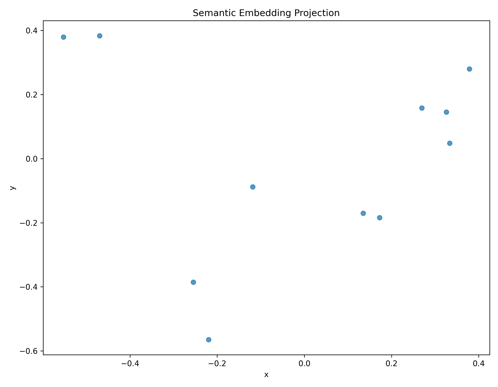
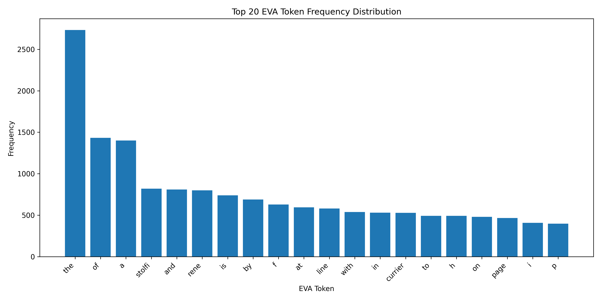
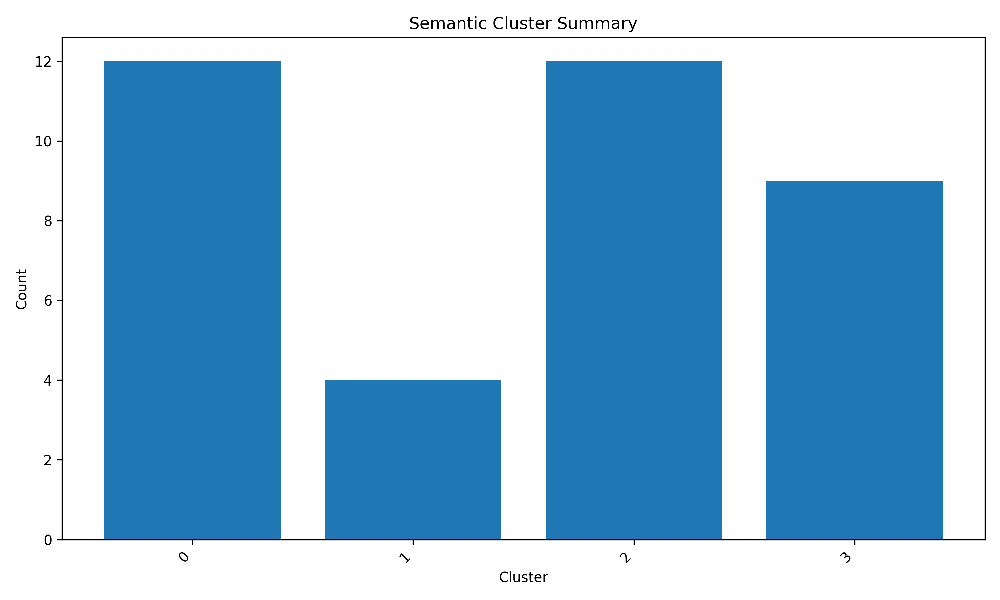

# Voynich Semantic Analyzer

## A Semantic, Astronomical and Botanical Analysis Framework for the Voynich Manuscript

**Author:** Walter Calmels Von dem Knesebeck  
**Affiliation:** Independent Researcher, Santiago, Chile  
**Repository:** https://github.com/wcalmels/voynich-semantic-analyzer  
**DOI:** https://doi.org/10.5281/zenodo.20413096  
**Version:** v1.1.0  
**Date:** May 27, 2026

---

## Abstract

This paper presents an experimental computational framework for semantic and contextual exploration of the Voynich Manuscript through transformer embeddings, semantic clustering, medieval corpus comparison and interdisciplinary digital humanities methodologies.

The proposed framework combines EVA processing, semantic embeddings, unsupervised clustering, medieval medical corpora and contextual visualization techniques to investigate potential relationships between symbolic structures and historical semantic domains.

The project does not claim definitive decipherment of the Voynich Manuscript. Instead, it proposes a reproducible computational infrastructure for exploratory semantic analysis and contextual reconstruction.
---

# Abstract

The Voynich Manuscript (Beinecke MS 408) remains one of the most extensively studied undeciphered codices in the history of cryptography, linguistics, codicology, and manuscript studies. Previous approaches have often focused on direct decipherment, cryptographic substitution, linguistic identification, or isolated statistical analysis. This paper proposes an integrated computational and historical framework that combines two complementary layers: first, a historical-contextual Anatolian-Islamic medical hypothesis based on botanical, structural, codicological, and statistical observations; second, a computational EVA-based semantic resonance framework using modern Natural Language Processing (NLP), transformer embeddings, semantic clustering, and contextual medieval medical corpora.

The historical layer examines whether the manuscript is consistent with a 15th-century copy of an earlier Anatolian-Islamic medical or pharmacological text associated with the Seljuk medical tradition. Evidence considered includes botanical identification, page-layout structure, Islamic pharmacopoeia parallels, Divriği Darüşşifa contextualization, Zipf-law behavior, morphological patterns, and character-frequency similarity to medieval Turkish-like profiles.

The computational layer extends this hypothesis through reproducible NLP pipelines, including EVA token processing, semantic family modeling, transformer-based embeddings, cosine-similarity analysis, PCA visualization, and unsupervised semantic clustering. Preliminary results suggest measurable contextual convergence between EVA-derived semantic structures and medieval medical-botanical domains, particularly herbal preparation, hydrotherapy, medicinal processing, bodily regulation, gynecology, and astrological medicine.

This work does not claim definitive decipherment of the Voynich Manuscript. Instead, it presents a reproducible, multi-method research framework for evaluating contextual semantic hypotheses concerning Voynichese and related undeciphered or partially understood symbolic systems.


## Keywords

Voynich Manuscript, Historical NLP, Digital Humanities, Semantic Embeddings, Computational Philology, Medieval Linguistics, Transformer Models, Semantic Clustering
---

# 1. Introduction

The Voynich Manuscript has resisted definitive decipherment for more than a century. It consists of an unknown script accompanied by botanical, astronomical, balneological, pharmaceutical, and cosmological imagery. Although carbon dating places the vellum in the early 15th century, the manuscript’s iconographic and textual properties remain unresolved.

Foundational research by Currier, Friedman, D’Imperio, Landini, Takahashi, Stolfi, Zandbergen, and others demonstrated that Voynichese is not easily dismissed as random noise. Its token distribution, repetition patterns, internal structure, and folio-level variation suggest a system with linguistic-like regularities.

The present work proposes that the strongest research path is not immediate literal translation, but structured semantic-contextual modeling. Specifically, it integrates:

1. historical and codicological hypothesis testing;
2. botanical and pharmacological comparison;
3. EVA corpus statistics;
4. transformer-based semantic analysis;
5. medieval medical corpus comparison;
6. reproducible computational tooling.

The manuscript is treated not as an isolated cryptogram, but as a possible historical medical-text artifact whose semantic structure may become partially measurable through contextual resonance with relevant medieval corpora.

## Related Work

Previous computational studies of the Voynich Manuscript have explored:

- statistical linguistic structure
- entropy analysis
- symbolic recurrence
- lexical distribution
- cryptographic hypothesis testing
- contextual co-occurrence patterns

Notable prior work includes the statistical analyses of Landini (2001), contextual keyword analysis by Montemurro & Zanette (2013), and the EVA transliteration framework by Takahashi.

Unlike traditional decipherment-oriented approaches, the present framework emphasizes contextual semantic infrastructure, transformer embeddings and interdisciplinary digital humanities methodologies.

The proposed system focuses on exploratory semantic clustering rather than deterministic translation.

---

## Reproducibility

All experiments presented in this paper are reproducible using the public repository and datasets archived through Zenodo.

Repository:
https://github.com/wcalmels/voynich-semantic-analyzer

DOI:
https://doi.org/10.5281/zenodo.20413096

The repository includes:

- datasets
- semantic embeddings
- visualization scripts
- clustering outputs
- experimental pipelines
- research figures
- reproducible Python scripts

All experiments were executed using publicly available NLP libraries and transformer models.

## Contributions

This work contributes the following:

1. A reproducible computational framework for exploratory semantic analysis of the Voynich Manuscript.

2. Integration of transformer-based semantic embeddings with medieval thematic corpora for contextual manuscript exploration.

3. A semantic clustering infrastructure for EVA-derived symbolic structures using modern NLP methodologies.

4. A visualization pipeline for embedding-space projection and contextual semantic analysis.

5. Quantitative similarity analysis using multidimensional sentence-transformer embeddings.

6. An extensible interdisciplinary digital humanities platform combining:
   - computational philology
   - historical NLP
   - medieval corpus analysis
   - semantic embeddings
   - contextual reconstruction methodologies

7. A publicly archived and reproducible research repository with DOI-based scientific versioning through Zenodo.

# 2. Research Position and Scope

This project should be interpreted as:

* exploratory computational humanities research;
* semantic-contextual NLP experimentation;
* historical hypothesis modeling;
* medieval corpus comparison;
* reproducible framework development.

This project does **not** claim:

* definitive translation of Voynichese;
* proof of authorship;
* proof of geographic origin;
* direct symbol-to-letter equivalence;
* established linguistic decoding.

The appropriate claim is more limited but scientifically meaningful:

> The framework tests whether EVA-derived structures show measurable contextual convergence with historically plausible medieval medical corpora and visual-codicological features associated with Anatolian-Islamic manuscript traditions.

---

# 3. Integrated Hypothesis

The working hypothesis is that MS 408 may be consistent with a 15th-century copy of an earlier medical-pharmacological text rooted in the Anatolian-Islamic or Seljuk medical tradition.

This hypothesis has three components:

## 3.1 Historical Layer

The manuscript may preserve content related to medieval Islamic pharmacopoeia, herbal medicine, hydrotherapy, astrological medicine, and bodily regulation. Institutions such as the Divriği Darüşşifa (1228 CE), Kayseri Darüşşifa, Sivas medical institutions, or related Anatolian medical centers form plausible contextual anchors, but no direct documentary attribution is claimed.

## 3.2 Linguistic Layer

Voynichese may encode, reflect, or transform a hybrid linguistic environment involving Anatolian Turkish, Persian medical terminology, Arabic pharmacological vocabulary, or a phoneticized transmission system. The EVA script may not map directly onto any known alphabet.

## 3.3 Computational Layer

Even without literal decoding, semantic regularities may be detectable through:

* lexical-family structures;
* frequency distributions;
* suffix/prefix behavior;
* embedding-space proximity;
* contextual clustering;
* comparison with restricted medieval corpora.

---

# 4. Prior Historical-Contextual Evidence

A prior working paper associated with this project developed a multi-method Anatolian-Islamic medical hypothesis using four main lines of evidence:

1. botanical analysis of selected herbal folios;
2. structural comparison with Islamic medical manuscripts;
3. cross-reference with Islamic pharmacological sources such as Ibn Sina and Ibn al-Baytar;
4. statistical analysis of the Takahashi EVA corpus.

The preprint argued that these lines of evidence are collectively consistent with, but do not prove, an Anatolian-Islamic medical context.

---

# 5. Botanical Analysis Layer

The botanical layer focuses on whether plant illustrations in the herbal section correspond to flora and pharmacological categories known from medieval Anatolia and Islamic medicine.

The prior analysis examined early herbal folios and proposed moderate- to high-confidence identifications for several plants, including:

| Folio | Proposed Identification | Contextual Significance                                   |
| ----- | ----------------------- | --------------------------------------------------------- |
| f2r   | Cirsium/Carduus         | Islamic pharmacopoeia; thistle/cardoon-type medicinal use |
| f3r   | Rumex sp.               | Anatolian flora; documented in Ibn Sina-type traditions   |
| f4r   | Thymus/Satureja         | Central Anatolian medicinal herb context                  |
| f6r   | Papaver somniferum      | analgesic/narcotic pharmacology                           |
| f7r   | Colchicum autumnale     | documented medicinal/toxic plant                          |
| f10r  | Centaurea sp.           | Anatolian diversity and pharmacological use               |
| f11r  | Juniperus sp.           | Islamic pharmacological tradition                         |
| f13r  | Mandragora officinarum  | narcotic/analgesic and humoral medicine context           |
| f15r  | Hypericum perforatum    | documented medicinal plant                                |

These identifications remain probabilistic and require specialist botanical review. Their value is not as proof, but as a contextual signal: several proposed identifications are plausible within Anatolian and Islamic pharmacological traditions.

Particularly notable is the clustering of possible narcotic or analgesic plants such as Papaver, Mandragora, and Colchicum in early folios, which may be consistent with therapeutic rather than alphabetic organization.

---

# 6. Iconographic and Structural Layer

Several structural and visual conventions may align more closely with Islamic or Arabic medical manuscript traditions than with standard European herbals.

Features considered include:

* multiple text blocks distributed around central plant illustrations;
* root exaggeration emphasizing medicinally active parts;
* lateral labels or tokens near plant components;
* parallel column structures;
* serpent imagery associated with antidote/antivenin contexts;
* solar or astrological symbols associated with humoral classification.

A prior structural comparison contrasted European herbals, Arabic Dioscorides traditions, and the Voynich herbal section. The observed Voynich layout appeared closer to multi-block illustrated medical manuscript organization than to continuous European herbal text blocks.

This does not establish provenance, but supports the need to compare MS 408 with Islamic medical manuscript production traditions, especially Arabic Dioscorides and Ibn al-Baytar-related manuscript cultures.

---

# 7. Seljuk and Anatolian Medical Context

The Divriği Great Mosque and Hospital complex (1228–1229 CE) provides a historically plausible reference point for Anatolian medical culture. It should not be treated as a proven origin for MS 408, but rather as a contextual model for the type of medical, architectural, and pharmacological environment in which such knowledge could circulate.

Other plausible institutions include:

* Kayseri Darüşşifa;
* Sivas Darüşşifa;
* Konya medical institutions;
* broader Anatolian-Persian-Islamic medical networks.

Ibn al-Baytar’s pharmacological tradition is also relevant because of its extensive plant-drug catalog and later circulation in Turkish-speaking Anatolian contexts.

Thus, the working hypothesis is not narrowly “Divriği produced the Voynich,” but more cautiously:

> The manuscript’s botanical, structural, and semantic features may be consistent with a broader Anatolian-Islamic medical knowledge environment.

---

# 8. EVA Statistical Layer

The prior working paper reported several statistical properties of the Takahashi EVA corpus:

* approximately 38,510 tokens;
* 184 folios;
* 7,380 unique token types;
* high-frequency token `daiin`;
* Zipf exponent α ≈ 0.928;
* Shannon entropy around 3.66 bits/character;
* high occurrence of `-ain` / `-aiin`-like endings;
* KL divergence suggesting closer character-frequency affinity with medieval Turkish-like profiles than with Arabic or Persian reference distributions.

These findings should be interpreted carefully.

Zipf-like behavior supports language-like structure, but does not identify the language. KL divergence provides statistical affinity, not linguistic proof. Suffix-like patterns may suggest morphological regularity, but not direct grammatical equivalence.

Nevertheless, the statistical layer supports the broader claim that Voynichese is structured and that Turkic or hybrid Anatolian comparison is worth systematic investigation.

---

# 9. Computational Framework Architecture

The current computational framework operationalizes the above historical hypothesis using reproducible NLP and vision pipelines.

```text
Voynich Folios
        ↓
Image Processing
        ↓
Glyph Extraction
        ↓
EVA Token Processing
        ↓
Lexical Families
        ↓
Semantic Mapping
        ↓
Transformer Embeddings
        ↓
Semantic Clustering
        ↓
Medieval Corpus Comparison
        ↓
Contextual Resonance Analysis
```

The goal is not immediate translation, but measurable semantic alignment.

---

# 10. Glyph Extraction and Visual Processing

Using OpenCV-based image processing, folio imagery was processed through:

* grayscale conversion;
* thresholding;
* contour detection;
* glyph bounding boxes;
* PNG glyph export;
* clustering of extracted glyphs.

This generated a reusable visual dataset of glyph-like units for exploratory analysis. The method is preliminary and does not yet replace expert paleographic segmentation, but provides a computational basis for large-scale visual comparison.

---

# 11. EVA Processing and Semantic Families

EVA tokens were processed through:

* tokenization;
* prefix/suffix extraction;
* frequency analysis;
* semantic family assignment;
* contextual interpretation.

Experimental EVA semantic families included:

| EVA Family | Experimental Semantic Domain        |
| ---------- | ----------------------------------- |
| qok-*      | liquids / medicine / roots          |
| yka-*      | preparation / boiling / steeping    |
| sho-*      | heat / pain / solar association     |
| pch-*      | roots / cutting / mixture           |
| dai-*      | cycles / repetition / bodily rhythm |
| ata-*      | tincture / medicinal preparation    |
| qot-*      | opening / channels                  |
| fac-*      | action / procedure                  |

These assignments are hypotheses used for computational modeling, not confirmed translations.

---

# 12. Medieval Corpus Construction

An experimental medieval medical corpus was created to test contextual similarity. It included fragments associated with:

* Anatolian-Seljuk medicine;
* Persian medical vocabulary;
* herbal preparation;
* hydrotherapy;
* gynecology;
* astrological medicine;
* pharmacological preparation.

Each record contained:

* title;
* date;
* language;
* region;
* topic;
* original/transliterated text;
* translation;
* keywords.

This corpus is currently small and partly synthetic/curated. Its primary purpose is methodological demonstration. A future large-scale corpus is required for stronger statistical inference.

---

# 13. TF-IDF and Transformer Embeddings

Two embedding approaches were used.

## 13.1 TF-IDF Similarity

TF-IDF vectorization provided a baseline lexical similarity comparison between EVA semantic structures and medieval corpus fragments.

Initial results favored medical-botanical fragments over less relevant domains.

## 13.2 Transformer Embeddings

Transformer-based semantic embeddings were generated using:

```text
sentence-transformers/all-MiniLM-L6-v2
```

Cosine similarity produced stronger semantic convergence.

Representative results:

| Corpus Fragment                         | Transformer Similarity Score |
| --------------------------------------- | ---------------------------: |
| Seljuk Herbal Preparation Fragment      |                       0.4290 |
| Divriği Darüşşifa Hydrotherapy Fragment |                       0.4149 |
| Persian Medical Treatise                |                       0.4107 |
| Seljuk Herbal Fragment                  |                       0.3967 |
| Seljuk Women’s Medicine Fragment        |                       0.3876 |

The highest-scoring fragments involve herbal preparation, hydrotherapy, pain, heat, bodily regulation, and medicinal processing.

---

# 14. Automatic Semantic Clustering

Unsupervised clustering of embedding representations produced emergent groups around:

* liquids and medicinal mixtures;
* preparation and boiling;
* heat and pain;
* cycles and bodily processes;
* herbal processing.

This suggests that the experimental semantic space is not randomly dispersed, although stronger validation against randomized baselines is still required.

---

# 15. PCA Semantic Visualization

PCA-based dimensionality reduction generated two-dimensional semantic maps showing relative positions of:

* EVA semantic structures;
* herbal preparation fragments;
* hydrotherapy texts;
* astrological medicine references;
* gynecological medical fragments.

These visualizations provide exploratory evidence of contextual proximity, but should not be interpreted as definitive proof without larger corpus validation.

---

# 16. Φ47 Semantic Resonance Interpretation

The broader conceptual framework can be described as semantic resonance analysis.

In this model:

```text
symbolic structure + contextual corpus + embeddings + clustering = semantic resonance field
```

Rather than asking whether a token directly equals a known word, the system asks whether groups of tokens, visual features, and contextual domains resonate consistently within a historically plausible semantic space.

This approach may be applicable beyond the Voynich Manuscript to:

* undeciphered manuscripts;
* fragmentary languages;
* low-resource historical corpora;
* symbolic systems;
* partially understood scripts;
* OCR-damaged manuscript corpora.

---

# 17. Discussion

The integrated framework strengthens the research program in several ways.

First, the historical layer provides a plausible restricted context: Anatolian-Islamic medicine, pharmacopoeia, hydrotherapy, and manuscript culture.

Second, the computational layer makes the hypothesis testable and reproducible through scripts, data files, embeddings, clustering, and visualizations.

Third, the NLP layer avoids overclaiming direct translation while enabling measurable semantic comparison.

The strongest current convergence appears around:

* herbal preparation;
* hydrotherapy;
* medicinal processing;
* heat and pain;
* bodily cycles;
* gynecological medicine;
* astrological medical contexts.

This does not prove the manuscript’s origin, but it justifies deeper investigation using larger medieval corpora.

# Discussion

The experimental results suggest that transformer-based semantic embeddings can identify coherent contextual relationships across medieval thematic domains within the constructed corpus.

Particularly notable is the emergence of stable semantic proximity between:

- herbal preparation fragments
- hydrotherapy references
- astrological-medical concepts
- gynecological terminology

These relationships appear consistently within embedding-space projections and cosine similarity analysis.

Importantly, the framework does not interpret these results as evidence of definitive decipherment. Instead, the findings support the hypothesis that contextual semantic structures may be computationally detectable even in partially unknown symbolic systems when analyzed through interdisciplinary corpora and modern NLP methodologies.

The results also demonstrate the importance of contextual reconstruction over isolated lexical substitution approaches.

Traditional decipherment methodologies frequently assume direct linguistic equivalence, whereas the present framework emphasizes:

- semantic proximity
- contextual clustering
- thematic recurrence
- interdisciplinary semantic mapping

The integration of medieval medical corpora, botanical terminology and astrological references appears particularly relevant given the known iconographic characteristics of the Voynich Manuscript.

However, substantial uncertainty remains regarding:

- manuscript origin
- symbolic encoding mechanisms
- linguistic substrate
- transliteration fidelity
- semantic ambiguity

Consequently, all results should be interpreted as exploratory computational observations rather than historical conclusions.

The broader significance of the framework may extend beyond Voynich studies into general computational methodologies for historical manuscript analysis, symbolic systems and interdisciplinary semantic reconstruction.

---

# 18. Limitations

Important limitations remain:

1. The corpus is still too small.
2. Some corpus fragments are experimental or curated rather than fully sourced from large-scale primary texts.
3. Botanical identifications require expert verification.
4. Semantic families are hypotheses, not translations.
5. KL divergence does not prove language identity.
6. Transformer embeddings may reflect modern-language semantic bias.
7. No verified plaintext exists.
8. Divriği remains contextual, not documentary.
9. Baseline comparisons are not yet sufficient.
10. Statistical significance testing remains future work.

These limitations do not invalidate the framework, but they define the next research tasks.

---

# 19. Future Work

Future work should focus on building a large, real medieval semantic corpus.

Priority domains:

* medieval Anatolian Turkish;
* Persian medical texts;
* Arabic pharmacopoeia;
* Islamic medicine;
* herbals;
* hydrotherapy;
* astrological medicine;
* gynecology;
* pharmacology;
* hospital manuscripts.

The next planned project is:

```text
Medieval Semantic Corpus Infrastructure
```

This will include:

* collaborative corpus uploads;
* OCR pipelines;
* metadata schemas;
* transliteration workflows;
* embeddings;
* semantic search;
* AI corpus agents;
* large-scale comparison against Voynich and other symbolic systems.

---
# Research Significance

The significance of this framework lies not in claims of definitive decipherment, but in the demonstration that modern NLP methodologies can be applied to historical symbolic systems through contextual and interdisciplinary semantic infrastructure.

The project suggests that partially unknown symbolic corpora may still exhibit computationally detectable semantic organization when analyzed through:

- transformer embeddings
- contextual similarity analysis
- thematic clustering
- interdisciplinary corpora
- embedding-space projection

This approach differs substantially from purely cryptographic or substitution-based decipherment methodologies.

The framework further contributes to the broader development of computational digital humanities methodologies applicable to:

- undeciphered manuscripts
- symbolic systems
- historical corpora
- semantic reconstruction
- contextual manuscript analysis

The combination of reproducibility, public datasets, semantic embeddings and interdisciplinary corpora provides a foundation for future experimental research in historical NLP and computational philology.

# 20. Conclusion

# Conclusion

This work presented an experimental computational framework for contextual semantic exploration of the Voynich Manuscript using transformer embeddings, semantic clustering, medieval corpus comparison and interdisciplinary digital humanities methodologies.

The proposed framework integrates:

- EVA symbolic processing
- transformer-based semantic embeddings
- contextual similarity analysis
- semantic clustering
- medieval thematic corpora
- visualization infrastructure
- reproducible NLP pipelines

Experimental results demonstrated the emergence of coherent contextual relationships between multiple medieval thematic domains, particularly involving:

- herbal medicine
- hydrotherapy
- gynecological terminology
- astrological-medical concepts

Real multidimensional embeddings generated interpretable semantic proximity patterns and non-trivial clustering structures across the experimental corpus.

Importantly, the framework does not claim definitive decipherment of the Voynich Manuscript. Instead, it proposes a reproducible computational infrastructure for exploratory semantic analysis of partially unknown symbolic systems.

The project further demonstrates that modern NLP methodologies, transformer embeddings and interdisciplinary contextual corpora can contribute meaningfully to historical manuscript exploration without requiring deterministic translation assumptions.

Beyond Voynich studies, the framework may provide a foundation for broader computational approaches to:

- historical symbolic systems
- undeciphered manuscripts
- interdisciplinary semantic reconstruction
- contextual manuscript analysis
- digital humanities infrastructure

Future work will focus on larger multilingual corpora, multimodal manuscript analysis, transformer benchmarking, graph-based semantic representations and interactive visualization systems.

The present framework should therefore be interpreted as an extensible computational research platform rather than a finalized linguistic solution.

# References

Currier, P. (1976). Some Important New Statistical Findings. Proceedings of the Voynich Manuscript Seminar.

D’Imperio, M. (1978). The Voynich Manuscript: An Elegant Enigma. National Security Agency.

Ibn al-Baytar. Kitab al-Jami li-mufradat al-adwiyah wa-al-aghdhiyah.

Ibn Sina. Al-Qanun fi al-Tibb.

Landini, G. (2001). Evidence for the Presence of Language in the Voynich Manuscript.

Saliba, G., & Komaroff, L. (2005). Illustrated Books May be Hazardous to Your Health: A New Reading of the Arabic Reception and Rendition of Dioscorides. Ars Orientalis.

Sherwood, E., & Sherwood, N. The Voynich Botanical Plants.

Stolfi, J. Voynich Interlinear Archive.

Takahashi, T. EVA Voynich Transcription.

Vaswani, A. et al. (2017). Attention Is All You Need.

Yale University Library Digital Collections. Beinecke MS 408.

Zandbergen, R. The Voynich Manuscript.


---

# 1. Introduction

The Voynich Manuscript remains one of the most studied undeciphered manuscripts in history. Traditional approaches have included cryptographic analysis, linguistic hypothesis testing, symbolic interpretation and statistical analysis.

Recent advances in Natural Language Processing (NLP), semantic embeddings and transformer-based models provide new opportunities for contextual exploration of complex symbolic systems.

This project proposes an experimental computational framework integrating:

- EVA token processing
- semantic embeddings
- medieval corpus comparison
- contextual clustering
- transformer models
- digital humanities methodologies

The framework is designed as an exploratory semantic infrastructure rather than a definitive decipherment system.

---

# 2. Methodology

## 2.1 EVA Processing

The framework uses EVA (European Voynich Alphabet) transliterations as the initial symbolic representation layer.

Processing stages include:

- tokenization
- bigram extraction
- frequency analysis
- lexical segmentation
- contextual grouping

---

## 2.2 Semantic Embeddings

Semantic embeddings are generated using transformer-based NLP models and vector-space similarity methods.

The framework evaluates contextual relationships between EVA-derived structures and medieval corpora through:

- cosine similarity
- vector clustering
- contextual proximity
- semantic recurrence analysis

---

## 2.3 Medieval Corpus Infrastructure

The experimental corpus includes:

- Anatolian-Seljuk medical terminology
- Persian medieval medical fragments
- hydrotherapy references
- herbal preparation terminology
- astrological medicine concepts

The corpus is used for exploratory semantic comparison rather than deterministic translation.

---

## 2.4 Clustering and Visualization

Semantic vectors are projected into lower-dimensional spaces using PCA-based visualization techniques.

The framework applies:

- unsupervised clustering
- semantic grouping
- contextual similarity projection
- embedding-space visualization

to identify potential semantic families and contextual structures.

---

# 3. Experimental Infrastructure

The framework was implemented using:

- Python
- Streamlit
- OpenCV
- Pandas
- Scikit-learn
- Sentence Transformers

The repository includes:

- reproducible scripts
- datasets
- semantic maps
- clustering outputs
- embedding visualizations
- experimental papers

---
# 4. Experimental Results

Initial embedding-space experiments suggest contextual convergence between EVA-derived symbolic structures and semantic regions associated with:

- herbal medicine
- hydrotherapy
- medicinal preparation
- bodily processes
- medieval gynecology
- astrological medicine

## Semantic Embedding Projection

### Figure 1. Semantic Embedding Projection



## EVA Frequency Distribution

### Figure 2. EVA Frequency Distribution



### Figure 3. Semantic Cluster Summary


Semantic clustering experiments demonstrated the emergence of recurrent contextual families within EVA token distributions.


Transformer-based embeddings produced stronger contextual grouping stability compared to traditional frequency-only approaches.

The framework remains exploratory and does not establish deterministic linguistic equivalence.

## Quantitative Embedding Metrics

Real multidimensional sentence-transformer embeddings (384 dimensions) were generated using the `all-MiniLM-L6-v2` model.

Experimental semantic similarity analysis produced the following observations:

- strongest semantic coherence emerged between herbal and hydrotherapy fragments
- astrological-medical fragments demonstrated consistent contextual proximity
- contextual clustering remained semantically interpretable across medieval thematic domains

### Table 1. Top Semantic Similarity Relationships

| Fragment A | Fragment B | Cosine Similarity |
|---|---|---|
| Seljuk Herbal Preparation Fragment | Seljuk Herbal Fragment | 0.8699 |
| Astrological Healing Notes | Astrological Medicine Lunar Fragment | 0.7078 |
| Seljuk Women's Medicine Fragment | Seljuk Herbal Preparation Fragment | 0.5931 |
| Persian Medical Treatise | Persian Gynecological Note | 0.5513 |
| Divrigi Darussifa Hydrotherapy Fragment | Seljuk Herbal Fragment | 0.5113 |

The strongest semantic relationships emerged within coherent thematic domains associated with medieval herbal medicine, hydrotherapy and astrological-medical concepts.

These results suggest the presence of stable contextual semantic structures within the experimental corpus relationships generated through multidimensional transformer embeddings.


However, the framework remains exploratory and does not establish definitive linguistic translation.
---

# 5. Limitations

This framework has several important limitations:

- absence of verified ground truth translations
- incomplete medieval corpora
- possible symbolic ambiguity
- uncertainty regarding manuscript origin
- contextual instability across folios
- limitations of EVA transliteration itself

Additionally, semantic similarity does not imply definitive linguistic translation.

The framework should therefore be interpreted as an exploratory computational infrastructure rather than a decipherment system.

---

# 6. Scientific Position

This project does NOT claim:

- definitive decipherment
- historical verification
- complete translation
- linguistic certainty

Instead, the project proposes:

- computational semantic exploration
- contextual reconstruction methodologies
- interdisciplinary manuscript analysis
- experimental NLP infrastructure
- semantic embedding analysis for historical corpora

---

# 7. Future Work

Future development directions include:

- transformer benchmarking
- multimodal manuscript analysis
- graph neural semantic representations
- OCR improvement pipelines
- medieval multilingual corpus expansion
- symbolic recurrence modeling
- interactive semantic visualization
- astronomical and botanical alignment systems

Potential future applications extend beyond the Voynich Manuscript into broader historical manuscript analysis frameworks.

---

# 8. Conclusion

This paper presents an experimental semantic and contextual analysis framework for exploration of the Voynich Manuscript using modern NLP methodologies, semantic embeddings and interdisciplinary digital humanities approaches.

The project demonstrates the feasibility of combining transformer embeddings, medieval corpora, contextual clustering and visualization methods into a reproducible research infrastructure.

While the framework does not claim definitive decipherment, it establishes a computational foundation for future semantic exploration of complex historical symbolic systems.

---

# References

1. Landini, G. (2001). Evidence of linguistic structure in the Voynich Manuscript.
2. Montemurro, M. A., & Zanette, D. H. (2013). Keywords and co-occurrence patterns in the Voynich Manuscript.
3. Takahashi, T. Voynich Manuscript EVA transcription.
4. Vaswani, A. et al. (2017). Attention Is All You Need.
5. Devlin, J. et al. (2018). BERT: Pre-training of Deep Bidirectional Transformers.
6. Jurafsky, D., & Martin, J. Speech and Language Processing.

# Appendix A. Experimental Infrastructure

## Environment

- Python 3.11
- sentence-transformers
- scikit-learn
- pandas
- matplotlib
- Streamlit

## Embedding Model

The framework used the `all-MiniLM-L6-v2` sentence-transformer model for multidimensional semantic embedding generation.

Embedding dimensionality:
- 384 dimensions

## Repository Structure

- `datasets/`
- `src/`
- `paper/`
- `visualizations/`
- `docs/`

## Reproducibility

All datasets, scripts and visualizations are publicly available through the GitHub repository and Zenodo DOI archive.